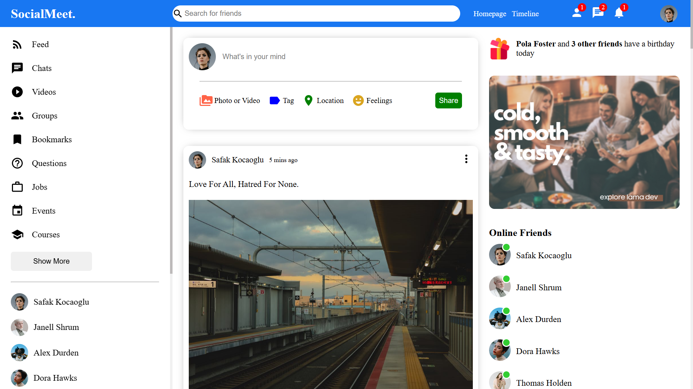

# 🌐 Social-Meet

## Overview

Social-Meet is a social media platform built using React.

## 🔗 Project URL

Check out the live version of the project here: [Social-Meet](https://react-social-meet.netlify.app/)

## 🖼️ Screenshots

## 🛠️ Technologies Used

- **React:** A JavaScript library for building user interfaces.
- **Styled Components/CSS Modules:** For styling the application in a modular and maintainable way.

## 🚀 Getting Started

To run this project locally, follow these steps:

1. Clone the repository: `git clone https://github.com/Developer-Bilal/social-meet.git`
2. Navigate to the project directory: `cd social-meet`
3. npm install
4. npm start

The application should now be running on http://localhost:3000.

## 📧 Contact

If you have any questions or suggestions, feel free to reach out:

- Email: bilalchanna67@gmail.com ✉️
- LinkedIn: [Profile](https://www.linkedin.com/in/Engineer-Bilal-Channa) 💼
